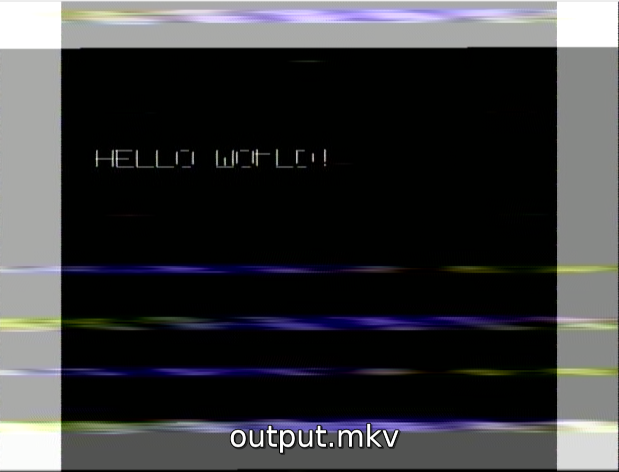

# CVBS synth

Use a software audio synthesis tool to generate analog video (CVBS / composite / that yellow RCA connector)

Audio synthesis: [SuperCollider](https://supercollider.github.io/)

Video decoding software to confirm output: [CVBS-Decode](https://github.com/oyvindln/vhs-decode/wiki/CVBS-Composite-Decode), part of [VHS decode](https://github.com/oyvindln/vhs-decode)

**NOTE** This is a very experimental process and toolchain for now.

## Goals

## Motivation

## Requirements

* [SuperCollider](https://supercollider.github.io/), `sclang`
* [VHS decode](https://github.com/oyvindln/vhs-decode), `cvbs-decode`, `ld-analyse`, `tbc-video-export`

Copy the contents of this repo's `Extensions/` folder (`CVBS.sc`) to your [SuperCollider Extensions folder](https://doc.sccode.org/Guides/UsingExtensions.html) under a new folder named `CVBS/` to make the CVBS SynthDefs available to SuperCollider scripts.

Examples can be found in the [Examples/](./Examples/) folder. The scripts use SuperCollider's [non-realtime (NRT) synthesis](https://doc.sccode.org/Guides/Non-Realtime-Synthesis.html) to generate mono `.flac` audio files @ 28.6KHz.

These are recognised as input to CVBS decode as 28.6 MHz/8-bit (8fsc) Stock Crystal Native 8xFsc 8bit Unsigned Sampling Mode (with the `--cxadc` flag).
Note the 1000x difference in 28.6 _KILO_ Hz _audio_ output to 28.6 _MEGA_ Hz video input.
This 1000x difference is what allows us to use audio synthesis techniques to generate the higher frequency video signals.

Playing these signals on real hardware will require playback at 1000x the frequency.
I have yet to fully explore the hardware of the VHS decode project and am just playing with software synthesis and playback for now.

## Usage

Bash build script e.g.:

    ./build.sh Examples/helloworld.scd

Will generate `output.flac` -> `output.tbc` -> `output.mkv`

ch.
 Sep 2025
